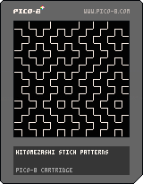
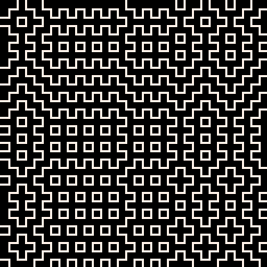

# pico8-hitomezashi

A small pico-8 implementation of the hitomezashi stitch patterns.

## Inspiration

Inspired by https://www.youtube.com/watch?v=JbfhzlMk2eY and https://github.com/johshoff/hitomezashi .

## Interact

- Press up/down to change colour.
- Press left/right to remove/add noise. (Random bitshifts.)
- Press 'x' to get a new random tile size
- Press 'c' to get a new grid

## Demo

